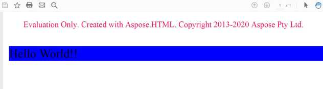
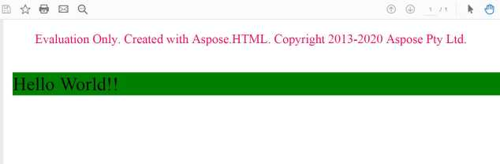
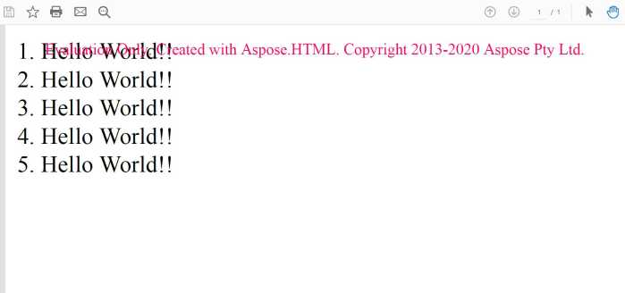

Using the [Converter.ConvertHTML](https://apireference.aspose.com/net/html/aspose.html.converters/converter/methods/converthtml/index) methods is the most common way to convert HTML code into various formats. However, Aspose.HTML API also provides alternative ways to render HTML documents with that can give you more control over the rendering process in your C# application.
## **Output Device**
The output device encapsulates a 2D drawing surface, whose API is implemented using the [IDevice](https://apireference.aspose.com/net/html/aspose.html.rendering/idevice) interface. Currently, API provides the following implementations: [PdfDevice](https://apireference.aspose.com/net/html/aspose.html.rendering.pdf/pdfdevice), [XpsDevice](https://apireference.aspose.com/net/html/aspose.html.rendering.xps/xpsdevice) and [ImageDevice](https://apireference.aspose.com/net/html/aspose.html.rendering.image/imagedevice), which are used to generate PDF, XPS and Image file formats, respectively.

The next example shows how to use [PdfDevice](https://apireference.aspose.com/net/html/aspose.html.rendering.pdf/pdfdevice) to render HTML document into PDF file:

1. Create an instance of HTML document.
1. Create an instance of PDF Output Device.
1. Call [HTMLDocument.RenderTo](https://apireference.aspose.com/net/html/aspose.html/htmldocument/methods/renderto) method with specified device.


## **Device Options**
Rendering Options gives you additional control over the output device. You can change the page size, configure margins and colors, set a security password in case of PDF device, etc. Every output device [PdfDevice](https://apireference.aspose.com/net/html/aspose.html.rendering.pdf/pdfdevice), [XpsDevice](https://apireference.aspose.com/net/html/aspose.html.rendering.xps/xpsdevice) and [ImageDevice](https://apireference.aspose.com/net/html/aspose.html.rendering.image/imagedevice) has his own unique set of options and implemented with classes [***PdfRenderingOptions***](https://apireference.aspose.com/net/html/aspose.html.rendering.pdf/pdfrenderingoptions), [***XpsRenderingOptions***](https://apireference.aspose.com/net/html/aspose.html.rendering.xps/xpsrenderingoptions) and [***ImageRenderingOptions***](https://apireference.aspose.com/net/html/aspose.html.rendering.image/imagerenderingoptions), respectively.

Following is a demonstration of how to use Rendering Options to customize the page-size:


### **General Options**
Rendering Options gives you additional control over the output device. You can change the page size, configure margins and colors, set a security password in case of PDF device, etc. Every output device [PdfDevice](https://apireference.aspose.com/net/html/aspose.html.rendering.pdf/pdfdevice), [XpsDevice](https://apireference.aspose.com/net/html/aspose.html.rendering.xps/xpsdevice) and [ImageDevice](https://apireference.aspose.com/net/html/aspose.html.rendering.image/imagedevice) has his own unique set of options and implemented with classes [***PdfRenderingOptions***](https://apireference.aspose.com/net/html/aspose.html.rendering.pdf/pdfrenderingoptions), [***XpsRenderingOptions***](https://apireference.aspose.com/net/html/aspose.html.rendering.xps/xpsrenderingoptions) and [***ImageRenderingOptions***](https://apireference.aspose.com/net/html/aspose.html.rendering.image/imagerenderingoptions), respectively.

Following is a demonstration of how to use Rendering Options to customize the page-size:



The next few pictures show the result of the rendering with 50 dpi and 300 dpi resolutions:

#### **CSS Media Type**
CSS media-type is an important feature that specifies how a document is to be presented on different media: on the screen, on paper, with a braille device, etc. There are few ways to specify media-type for a style sheet, via linked style sheets:

**Linked Style Sheet**



 <link rel="stylesheet" type="text/css" media="print" href="style.css">



or, via inlining:

**Inline Style Sheet**



 



Aspose.HTML API supports this feature, so you can convert HTML documents as they look on screen or on print with applying the corresponded media types and style sheets. Following example shows how to set up the media type:



 // Create an option class

var options = new PdfRenderingOptions();

// Set the 'screen' media-type

options.Css.MediaType = MediaType.Screen;



{} 

Please note that the default value of the [CssOptions.MediaType](https://apireference.aspose.com/net/html/aspose.html.rendering/cssoptions/properties/mediatype) is Print. It means that the document will be converting with applying style sheets related to the printing device and looks like on paper (you can use print preview of your browser to see the difference). If you want the document to look the way it is rendered on screen, you should use [MediaType.Screen](https://apireference.aspose.com/net/html/aspose.html.rendering/mediatype).

{} 
#### **Background Color**
A property that specifies the background color of the output drawing surface.


#### **Page Setup**
The page setup is a set of parameters that determine the layout of a printed page. Those parameters include everything from the page size, margins, and auto-resizing to @page priority rules. Using this set of parameters, you can easily set up an individual layout for every page.

The next example demonstrates how to create PDF with different page sizes for the left and right pages.



In some cases, the content of the HTML page could be wider than the page-size defined with options. If you don’t want to cut off the page content, you can try the PageSetup.AdjustToWidestPage property. The following example shows how to adjust the page size to the content. 


### **PDF Options**
Using a specialized [PdfRenderingOptions](https://apireference.aspose.com/net/html/aspose.html.rendering.pdf/pdfrenderingoptions) object, you can configure permissions for the PDF file. The next example demonstrates this feature.


### **Image Options**
[ImageRenderingOptions](https://apireference.aspose.com/net/html/aspose.html.rendering.image/imagerenderingoptions/properties/compression) allows you to customize a wide range of setting from smoothing (antialiasing), image resolution, and formats to image compression.

Following example demonstrates how to change resolution and antialiasing for the resulted image.


### **XPS Options**
[XPS](https://en.wikipedia.org/wiki/Open_XML_Paper_Specification) files generated by our library do not have any specific parameters. All parameters of [XpsRenderingOptions](https://apireference.aspose.com/net/html/aspose.html.rendering.xps/xpsrenderingoptions) are inherited from the base [RenderingOptions ](https://apireference.aspose.com/net/html/aspose.html.rendering/renderingoptions/properties/pagesetup)class and described [here](/html/net/fine-tuning-converters/#fine-tuningconverters-generaloptions).


## **Renderers**
While the [Document.RenderTo](https://apireference.aspose.com/net/html/aspose.html.dom/document/methods/renderto) method gives you the ability to send a single document to the output rendering device, using the [Renderer](https://apireference.aspose.com/net/html/aspose.html.rendering/renderer) instances directly you can send multiple files at once. Aspose.HTML API provides the following implementation of renderers: [HtmlRenderer](https://apireference.aspose.com/net/html/aspose.html.rendering.pdf/pdfdevice), [SvgRenderer](https://apireference.aspose.com/net/html/aspose.html.rendering.xps/xpsdevice), [MhtmlRenderer](https://apireference.aspose.com/net/html/aspose.html.rendering/mhtmlrenderer) and [EpubRenderer](https://apireference.aspose.com/net/html/aspose.html.rendering.image/imagedevice), which are used to render HTML, SVG, MHTML and EPUB documents, respectively.

The next example demonstrates how to use [HtmlRenderer](https://apireference.aspose.com/net/html/aspose.html.rendering/htmlrenderer) to render multiple documents:


### **Timeout**
One more important feature that is available for renderers is timeout. You can use it to specify how long you are ready to wait for all internal processes related to a document lifecycle to be completed, such as resource loading, active timers, etc. Sure, you can specify an infinite waiting period. However, if the document contains a script with the endless loop, you will wait indefinitely. The example below demonstrates how to use the timeout parameter: 



Running this example, you will get a document with five lines of ‘Hello World’ message, as it follows:

