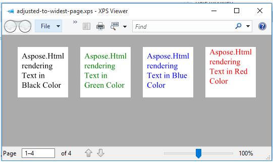

## **Basics of Conversion**
` `We have a package named **com.aspose.html.rendering.xps** which provides the feature to create XPS file from HTML document. The XpsRenderingOptions class offers the capabilities to set different rendering options and formatting properties while creating a resultant XPS file. We have getPageSetup(...) method under XPSRenderingOptions class which provides the flexibility to set page settings for resultant file. The getPageSetup(...) also provides different methods i.e. getFirstPage(), getLastPage(), getLeftPage(), getRightPage() and they are used to setup (PageSize, Margin) for every page. In most cases, usage of setup any page is enough, but in some complicated cases, you may need to fine tune page settings. It can be done either by [CSS styles](https://www.w3.org/TR/css3-page/#page-selectors) or by using rendering options.

The getAnyPage() method accepts com.aspose.html.drawing.Page instance where we can define the Margin and Size of resultant page. In order to define the size for resultant page which can be passed to getAnyPage() or other method, we use com.aspose.html.drawing.Size object and in order to define the Margin information, we need to pass new com.aspose.html.drawing.Margin(10,10,10,10) object where it represents (Left, Top, Right, Bottom) margin information.

When specifying the size information, the unit for size is pixel and in following example, 200 is used as width and 60 is used as height.

Once we have defined the XPSRenderingOptions object, the next thing is to instantiate XpsDevice object where we pass XPSRenderingOptions object as first argument and second argument is resultant file path or stream instance which will hold the resultant file.

Create **HtmlRenderer** object which will trigger the rendering process. Now we need to specify the HTML file / contents which we need to convert and for that purpose, we need to create **HTMLDocument** instance which will load HTML file contents. Finally call the Render method of HtmlRenderer while passing XpsDevice object as first argument and HtmlDocument object as second argument.



{} 

In order to only setup page settings and margin, use PageSetup

com.aspose.html.rendering.xps.XpsRenderingOptions xps_options = new com.aspose.html.rendering.xps.XpsRenderingOptions();
xps_options.getPageSetup().setFirstPage(new com.aspose.html.drawing.Page(new com.aspose.html.drawing.Size(200, 60)));

- If we comment out the PageSetup property for XpsRenderingOptions, all pages will be rendered.

The API also offers the feature to set Left and Right page and their rendering. When using this approach, we need to specify the Page dimensions/configurations for both Left and Right Page.
XpsRenderingOptions.xps_options.getPageSetup().setLeftRightPage(new com.aspose.html.drawing.Page(new com.aspose.html.drawing.Size(70, 70)), new com.aspose.html.drawing.Page(new com.aspose.html.drawing.Size(50, 50))); 

{} 
## **Adjust page size according to content during conversion**
The XpsRenderingOptions class offers various properties to control the formatting / layout and dimensions of resultant document. The AdjustToWidestPage property Gets or sets flag that determines case when calculated context will be adjusted to widest page in document. However this options is time-consuming and the time of document processing can be increased.

This following code snippets shows how to adjust output page size according to the content width of the document



