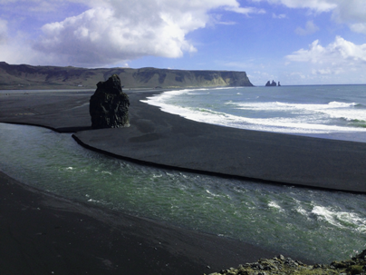

# **Iceland**

Iceland is a large island in the Atlantic Ocean and a country of extreme geological contrasts. Formed about 25 million years ago, Iceland is one of the youngest landmasses on the planet and consequently home to some of the world's most active volcanoes. 
			
## Black Sand Beach
	
	
## Namaskard Geothermal Area

